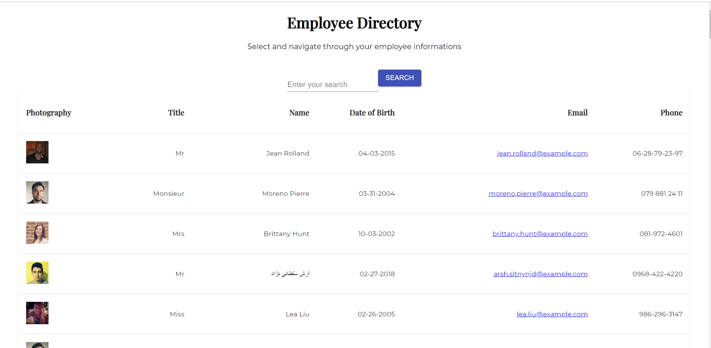

# Unit 19 React Homework: 

Employee Directory

## Links:

GitHub repository: 
https://github.com/Clem-ent17/employee-directory

Heroku live URL:
https://blooming-hollows-28066.herokuapp.com/

## User Story

- As a user
- I want to be able to view my entire employee directory at once
- So that I have quick access to their information.

## Business Context

An employee or manager would benefit greatly from being able to view non-sensitive data about other employees. It would be particularly helpful to be able to filter employees by name.

## Description

When a user connect to the App he can see the following the details of his employees, here generated through [Random User API](https://randomuser.me/):

- Photography

- Title 

- Full name

- Date of Birth

- Email 

- Phone

## Installation:

* Make sure the `package.json` is installed by typing `npm install` in your console.

## Technologies:

* Table of random users generated from the [Random User API](https://randomuser.me/), when the user loads the page, a table of employees render.

* This app use the npm dependencies: material-ui/core, for the styling of the table

## Project status:

* The next step on this project will be to figure out the solution to:

- Sort the table by at least one category

- Filter the users by at least one property.

- - -

Clement Valles

